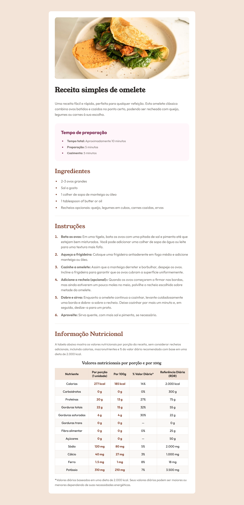

# Receita de Omelete

Projeto front-end desenvolvido com foco em estruturação visual de uma página de receita, com atenção à tipografia, organização do conteúdo e adaptação para telas menores.

## Visão geral

Esta página apresenta uma receita de omelete em um layout limpo e bem dividido, com seções para ingredientes, modo de preparo e informação nutricional.

## Prévia do projeto

## Tecnologias utilizadas

- HTML
- CSS

## Estrutura do projeto

- `index.html`
- `style.css`
- `images/`
- `referencia/`

## Finalidade

Este projeto foi utilizado como prática de estruturação de página, estilização visual e organização de conteúdo em um formato mais próximo de um projeto de portfólio.
